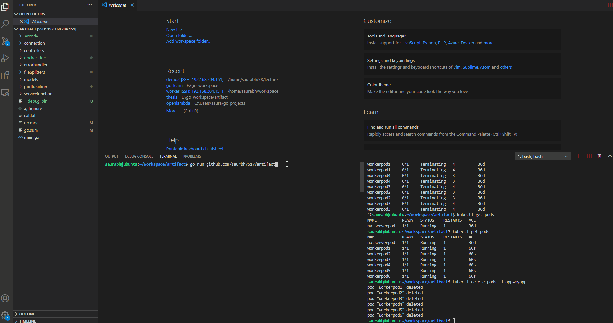

# Optimizing communication between serverless functions(Master's Thesis)
- Model developed to show peer-to-peer communication between serverless functions

## Tech Stack
- Golang
- NATS server
- Kubernetes
- Docker
- Ubuntu linux server

## Problem
- Current serverless platforms donot have address aware function manager, i.e the developer doesnot have any idea of where the functions are launched on the serverless platform.

## Solution
- Development of a function aware manager on a custom serverless platform( using golang, docker and kubernetes).
- Implementing a scatter-gather communication that shows the master to distribute jobs to the workers.
- Collection of results from the workers by the master once the job is completed.

## Demo
- To show communication between serverless functions, a master and a set of workers are created.
- The master is a HTTP server that receives a file, it divides that file into chunks depending on configurable size.
- Number of chunks generated is equal to the number of workers spawned.
- The chunks are distributed to the workers once they are in running state(state checks and updates handled by k8's).
- The workers receive(communication over NATS) those chunks process and return the result back.

